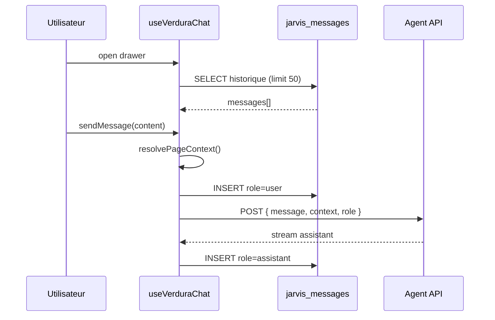

# Spécification UX/UI — Agent IA Verdura

> **Version :** 1.0 — 19 août 2026  
> **Rôle :** Senior UX Engineer & Product Designer  
> **Références :** `docs/AUDIT_APPLICATION_VERDURA.md`, `docs/SPEC_FICHES_METIERS_VERDURA.md`, `docs/SPEC_OUTILS_IA_VERDURA.md`  
> **Composants cibles :** `VerduraChatDrawer.tsx`, `useVerduraChat.ts`, `VerduraMarkdown.tsx`

---

## 0. Principes de design

| Principe | Application |
|----------|-------------|
| **Sobriété végétale** | Palette ardoise + émeraude très dilué — pas de saturation agressive |
| **Contexte visible** | L'utilisateur sait toujours sur quoi porte la conversation |
| **Réponses actionnables** | Synthèse d'abord, détail sur demande |
| **Confiance métier** | Badges outils, citations `project_number` / `internal_id` / `amm_number` |
| **Accessibilité** | Contraste WCAG AA, focus visible, copie au clavier |

---

## A. Architecture interface — `VerduraChatDrawer.tsx`

### A.1 Intégration UI

Le chat est un **tiroir latéral droit** (Drawer Radix/shadcn) monté une seule fois dans `__root.tsx`, accessible depuis **toute page authentifiée**.

```
__root.tsx
├── Sidebar + Header (existant)
├── Outlet (pages métier)
├── VerduraChatFab          ← bouton flottant discret
└── VerduraChatDrawer       ← drawer global
```

#### Déclencheurs d'ouverture

| Élément | Comportement |
|---------|--------------|
| **FAB** (coin inférieur droit) | Icône `MessageCircle` + pastille si messages non lus |
| Raccourci clavier | `Ctrl+Shift+V` / `⌘+Shift+V` |
| Header (optionnel) | Entrée « Assistant Verdura » à côté du `RoleSwitcher` |

#### Dimensions & comportement

| Breakpoint | Largeur drawer | Overlay |
|------------|----------------|---------|
| `< md` | `100vw` | Oui, assombri `bg-black/40` |
| `≥ md` | `420px` | Oui |
| `≥ xl` | `480px` | Non (push content optionnel — v2) |

```tsx
// src/components/ai/VerduraChatDrawer.tsx (structure)

interface VerduraChatDrawerProps {
  open: boolean;
  onOpenChange: (open: boolean) => void;
}

export function VerduraChatDrawer({ open, onOpenChange }: VerduraChatDrawerProps) {
  const chat = useVerduraChat();

  return (
    <Sheet open={open} onOpenChange={onOpenChange}>
      <SheetContent
        side="right"
        className="flex w-full flex-col p-0 sm:max-w-[420px] xl:max-w-[480px]"
      >
        <VerduraChatHeader {...chat} />
        <VerduraChatMessageList messages={chat.messages} isStreaming={chat.isStreaming} />
        <VerduraChatInput onSend={chat.sendMessage} disabled={chat.isStreaming} />
      </SheetContent>
    </Sheet>
  );
}
```

---

### A.2 Charte graphique sobriété

#### Palette messages

| Type | Classes Tailwind | Usage |
|------|------------------|-------|
| **Utilisateur** | `bg-slate-900 text-white rounded-2xl rounded-br-md px-4 py-2.5` | Bulle alignée droite |
| **Verdura (assistant)** | `bg-emerald-50/40 text-slate-800 border border-emerald-100/60 rounded-2xl rounded-bl-md px-4 py-2.5` | Bulle alignée gauche |
| **Système / erreur** | `bg-slate-100 text-slate-600 text-xs italic px-3 py-2 rounded-lg` | Timeouts, erreurs réseau |
| **Tool badge** | `bg-emerald-100 text-emerald-800 text-[10px] font-semibold uppercase tracking-wide px-2 py-0.5 rounded-full` | Ex. *Analyse Chantiers* |

#### Badges outils IA (mapping spec outils)

| Tool | Label badge |
|------|-------------|
| `getChantiersSummary` | Analyse Chantiers |
| `getEquipmentAlerts` | Flotte & Matériel |
| `getAnomaliesReport` | Suivi Incidents |
| `getProductsConformity` | Conformité Phyto |
| `getProfileGuide` | Guide Métier |

```tsx
function ToolBadge({ badge }: { badge: string }) {
  return (
    <span className="inline-flex items-center gap-1 bg-emerald-100 text-emerald-800 text-[10px] font-semibold uppercase tracking-wide px-2 py-0.5 rounded-full">
      {badge}
    </span>
  );
}
```

#### Typographie & espacement

- Police : héritée du design system (`font-sans`)
- Taille messages : `text-sm leading-relaxed`
- Espacement liste : `space-y-3` entre bulles
- Timestamp : `text-[10px] text-slate-400 mt-1`

---

### A.3 En-tête & actions

#### Structure `VerduraChatHeader`

```
┌─────────────────────────────────────────────────────────┐
│  🌿 Assistant Verdura                          [×]      │
│  ┌─────────────────────────────────────────────────┐  │
│  │ Contexte : Chantier C2024-01 · Équipe Nord      │  │
│  └─────────────────────────────────────────────────┘  │
│  [ Guides & Fiches Métier ]     [ Exporter .md ]        │
└─────────────────────────────────────────────────────────┘
```

#### Indicateur de contexte actif

Affiche une **puce contextuelle** synthétisée par `useVerduraChat().contextLabel` :

| Contexte détecté | Exemple affiché |
|------------------|-----------------|
| Chantier | `Contexte : Chantier C2024-01` |
| Matériel | `Contexte : Matériel TON-042` |
| Produit phyto | `Contexte : AMM 2100123` |
| Anomalies | `Contexte : Suivi incidents` |
| Page seule | `Contexte : Planning` |
| Aucun | `Contexte : Vue générale` |

```tsx
<div className="mx-4 mb-3 rounded-lg border border-emerald-100/60 bg-emerald-50/30 px-3 py-2 text-xs text-slate-700">
  <span className="font-medium text-emerald-800">Contexte :</span>{" "}
  {contextLabel}
</div>
```

#### Bouton « Guides & Fiches Métier »

- Style : `variant="outline"` + bordure émeraude légère
- Action : envoie **immédiatement** dans le chat une requête système déclenchant `getProfileGuide` selon `primaryRole`

```typescript
// Mapping rôle session → profil guide
const PROFILE_ROLE_MAP = {
  admin: "admin",
  coordinator: "coordinator",
  agent: "agent",
  partner: "elu-partenaire",
} as const;

function handleOpenProfileGuide() {
  sendMessage({
    content: "Affiche ma fiche métier et mes responsabilités.",
    intent: "profile_guide", // bypass parsing LLM — appel direct tool
  });
}
```

#### Bouton Copier (au survol)

- Position : coin supérieur droit de chaque bulle assistant
- Visibilité : `opacity-0 group-hover:opacity-100 transition-opacity`
- Action : copie le Markdown brut dans le presse-papier
- Feedback : toast « Copié »

```tsx
<div className="group relative">
  <Button
    variant="ghost"
    size="icon"
    className="absolute -top-2 -right-2 h-7 w-7 opacity-0 group-hover:opacity-100 transition-opacity"
    onClick={() => copyMarkdown(message.content)}
    aria-label="Copier la réponse"
  >
    <Copy className="h-3.5 w-3.5" />
  </Button>
  <VerduraMarkdown content={message.content} />
</div>
```

#### Bouton Export `.md`

- Génère un fichier daté : `verdura-chat_2026-08-19_23-42.md`
- Contenu : en-tête métadonnées + fil complet `jarvis_messages` de la session

```markdown
# Conversation Verdura — 2026-08-19 23:42

- **Utilisateur :** jeanmichel@digipous.com
- **Rôle :** coordinator
- **Contexte initial :** Chantier C2024-01

---

## Messages

### Utilisateur (23:40)
Quels chantiers sont en retard cette semaine ?

### Verdura (23:40)
**3 chantiers** en retard sur l'équipe Nord...
```

---

## B. Capture automatique de contexte — `useVerduraChat.ts`

### B.1 Architecture

```
useLocation() ──┐
useSearch()  ───┼──► resolvePageContext() ──► VerduraChatContext
VerduraPageContext (React) ──┘         │
                                       ▼
                              API payload + contextLabel
```

> **Alignement audit :** les routes dynamiques `/task/:id`, `/equipment/:id`, `/product/:id` **n'existent pas encore**. La spec définit un **contrat dual** : search params URL (standard cible) + contexte React partagé (implémentation immédiate avec `TaskDetailsSheet`).

---

### B.2 Contrat du Hook React `useVerduraChat`

#### Signature publique

```typescript
// src/hooks/useVerduraChat.ts

export type VerduraMessageRole = "user" | "assistant" | "system";

export interface VerduraChatMessage {
  id: string;
  role: VerduraMessageRole;
  content: string;
  createdAt: string;
  metadata?: {
    tool?: string;
    toolBadge?: string;
    context?: VerduraChatContext;
    errorCode?: string;
  };
}

export type VerduraPageKind =
  | "dashboard"
  | "planning"
  | "carte"
  | "coordinator"
  | "materiel"
  | "stocks"
  | "anomalies"
  | "analytics"
  | "settings"
  | "unknown";

export interface VerduraChatContext {
  /** Route TanStack normalisée */
  pathname: string;
  pageKind: VerduraPageKind;

  /** Entités actives (nullable) */
  taskId?: string;
  projectNumber?: string;
  equipmentId?: string;
  internalId?: string;
  productId?: string;
  ammNumber?: string;

  /** Scope session */
  userId: string;
  primaryRole: "admin" | "coordinator" | "agent" | "partner" | null;
  teamName: string | null;
  clientScope?: string[];

  /** Label UX header */
  contextLabel: string;
}

export interface SendMessageOptions {
  content: string;
  /** Appel direct outil sans LLM */
  intent?: "profile_guide" | "normal";
}

export interface UseVerduraChatReturn {
  /** État */
  messages: VerduraChatMessage[];
  isLoading: boolean;
  isStreaming: boolean;
  error: string | null;

  /** Contexte */
  context: VerduraChatContext;
  contextLabel: string;

  /** Actions */
  sendMessage: (options: SendMessageOptions) => Promise<void>;
  clearConversation: () => Promise<void>;
  exportMarkdown: () => string;
  reloadHistory: () => Promise<void>;

  /** Guides */
  sendProfileGuide: () => Promise<void>;
}

export function useVerduraChat(): UseVerduraChatReturn;
```

#### Cycle de vie



---

### B.3 Résolution de contexte par URL

#### Table de mapping routes Verdura (état actuel + cible)

| URL active | `pageKind` | Extraction primaire | Extraction secondaire (search params) |
|------------|------------|---------------------|---------------------------------------|
| `/` | `dashboard` | — | `?taskId=` |
| `/planning` | `planning` | — | `?taskId=` → fetch `project_number` |
| `/planning?taskId=uuid` | `planning` | `taskId` | API lookup → `projectNumber` |
| `/carte` | `carte` | — | `?taskId=` |
| `/coordinator` | `coordinator` | — | `?taskId=` |
| `/materiel` | `materiel` | — | `?equipmentId=` → `internalId` |
| `/stocks` | `stocks` | — | `?productId=` → `ammNumber` |
| `/anomalies` | `anomalies` | Contexte incidents | `?severity=`, `?status=open` |
| `/analytics` | `analytics` | — | — |
| `/settings` | `settings` | — | — |
| `/task/:id` *(futur)* | `planning` | `taskId` from params | — |
| `/equipment/:id` *(futur)* | `materiel` | `equipmentId` | — |
| `/product/:id` *(futur)* | `stocks` | `productId` | — |

#### Implémentation `resolvePageContext`

```typescript
import { useLocation, useSearch } from "@tanstack/react-router";
import { useAuth } from "@/lib/auth-context";
import { useVerduraPageContext } from "@/lib/verdura-page-context";

export function resolvePageContext(
  pathname: string,
  search: Record<string, unknown>,
  pageCtx: VerduraPageContextValue | null,
  auth: ReturnType<typeof useAuth>,
): VerduraChatContext {
  const pageKind = mapPathToPageKind(pathname);
  const taskId = (search.taskId as string) ?? pageCtx?.taskId;
  const equipmentId = (search.equipmentId as string) ?? pageCtx?.equipmentId;
  const productId = (search.productId as string) ?? pageCtx?.productId;

  const contextLabel = buildContextLabel({
    pageKind,
    projectNumber: pageCtx?.projectNumber ?? search.projectNumber as string,
    internalId: pageCtx?.internalId ?? search.internalId as string,
    ammNumber: pageCtx?.ammNumber ?? search.ammNumber as string,
  });

  return {
    pathname,
    pageKind,
    taskId,
    projectNumber: pageCtx?.projectNumber,
    equipmentId,
    internalId: pageCtx?.internalId,
    productId,
    ammNumber: pageCtx?.ammNumber,
    userId: auth.user!.id,
    primaryRole: auth.primaryRole,
    teamName: auth.profile?.team ?? null,
    contextLabel,
  };
}
```

#### `VerduraPageContext` — pont avec les Sheets existantes

Les pages utilisent aujourd'hui un state local `openTaskId` (`TaskDetailsSheet`). Le contexte React propage l'entité active **sans refonte routing immédiate** :

```typescript
// src/lib/verdura-page-context.tsx

export interface VerduraPageContextValue {
  taskId?: string;
  projectNumber?: string;
  equipmentId?: string;
  internalId?: string;
  productId?: string;
  ammNumber?: string;
}

// Exemple — planning-supabase-view.tsx
const { setPageContext } = useVerduraPageContextSetter();

useEffect(() => {
  if (openTaskId) {
    setPageContext({ taskId: openTaskId, projectNumber: selectedTask?.project_number });
  } else {
    setPageContext(null);
  }
}, [openTaskId, selectedTask]);
```

#### Payload API envoyé à l'agent

```typescript
export interface VerduraChatApiPayload {
  message: string;
  context: {
    pathname: string;
    pageKind: VerduraPageKind;
    taskId?: string;
    projectNumber?: string;
    equipmentId?: string;
    internalId?: string;
    productId?: string;
    ammNumber?: string;
    teamName?: string | null;
  };
  role: string | null;
  intent?: "profile_guide" | "normal";
}
```

#### Règles d'injection contextuelle → tools IA

| `pageKind` | Tool pré-sélectionné (hint LLM) | Paramètres auto-injectés |
|------------|--------------------------------|--------------------------|
| `planning`, `coordinator`, `carte` | `getChantiersSummary` | `teamName`, filtre `projectNumber` |
| `materiel` | `getEquipmentAlerts` | `internalId`, `teamName` |
| `stocks` | `getProductsConformity` | `ammNumber` |
| `anomalies` | `getAnomaliesReport` | `status: open`, `teamName` |
| Toute page + intent `profile_guide` | `getProfileGuide` | `role` depuis `primaryRole` |

---

### B.4 Persistance — table `jarvis_messages`

#### Schéma (audit Verdura)

| Colonne | Type | Usage UX |
|---------|------|----------|
| `id` | uuid | Clé message UI |
| `user_id` | uuid | RLS — session courante |
| `role` | `user` \| `assistant` \| `system` | Type bulle |
| `content` | text | Markdown |
| `metadata` | jsonb | `{ tool, toolBadge, context, errorCode }` |
| `created_at` | timestamptz | Tri chronologique |

#### Opérations hook

```typescript
// Chargement historique (ouverture drawer)
const { data } = await supabase
  .from("jarvis_messages")
  .select("id, role, content, metadata, created_at")
  .eq("user_id", userId)
  .order("created_at", { ascending: true })
  .limit(50);

// Persistance message utilisateur
await supabase.from("jarvis_messages").insert({
  user_id: userId,
  role: "user",
  content: message,
  metadata: { context: chatContext },
});

// Persistance réponse assistant (fin stream)
await supabase.from("jarvis_messages").insert({
  user_id: userId,
  role: "assistant",
  content: fullResponse,
  metadata: { tool, toolBadge, context: chatContext },
});

// Effacer conversation (action utilisateur)
await supabase
  .from("jarvis_messages")
  .delete()
  .eq("user_id", userId);
```

> **RLS :** policy `user_id = auth.uid()` — conforme audit. Pas de lecture croisée entre utilisateurs.

#### Stratégie offline / erreur

| Scénario | UX |
|----------|-----|
| BDD inaccessible | Messages en mémoire locale ; bannière « Historique non synchronisé » |
| Échec INSERT | Retry × 2 ; message système discret |
| Streaming interrompu | Bulle partielle + bouton « Réessayer » |

---

## C. Rendu Markdown — `VerduraMarkdown.tsx`

### C.1 Configuration technique

**Dépendances à ajouter :**

```bash
npm install react-markdown remark-gfm
```

```tsx
// src/components/ai/VerduraMarkdown.tsx

import ReactMarkdown from "react-markdown";
import remarkGfm from "remark-gfm";
import { cn } from "@/lib/utils";

interface VerduraMarkdownProps {
  content: string;
  /** Mode guide = pas de troncature, typographie plus aérée */
  variant?: "compact" | "guide";
  className?: string;
}

export function VerduraMarkdown({
  content,
  variant = "compact",
  className,
}: VerduraMarkdownProps) {
  return (
    <div className={cn("verdura-markdown prose prose-sm max-w-none", className)}>
      <ReactMarkdown
        remarkPlugins={[remarkGfm]}
        components={buildComponents(variant)}
      >
        {content}
      </ReactMarkdown>
    </div>
  );
}
```

---

### C.2 Règles de style — mapping composants

#### Tableaux (`remark-gfm`)

```tsx
table: ({ children }) => (
  <div className="my-3 overflow-x-auto rounded-lg border border-slate-200">
    <table className="w-full text-xs">{children}</table>
  </div>
),
thead: ({ children }) => (
  <thead className="bg-slate-800 text-white">{children}</thead>
),
th: ({ children }) => (
  <th className="px-3 py-2 text-left font-semibold">{children}</th>
),
tbody: ({ children }) => <tbody className="divide-y divide-slate-100">{children}</tbody>,
tr: ({ children, ...props }) => {
  const rowIndex = /* index via context ou nth-child */;
  return (
    <tr className={cn(rowIndex % 2 === 0 ? "bg-white" : "bg-slate-50/80")}>
      {children}
    </tr>
  );
},
td: ({ children }) => (
  <td className="px-3 py-1.5 text-slate-700">{children}</td>
),
```

#### Listes & check-lists GFM

```tsx
ul: ({ children }) => (
  <ul className="my-2 list-disc pl-4 space-y-0.5 [&>li]:m-0 [&>li]:p-0">{children}</ul>
),
ol: ({ children }) => (
  <ol className="my-2 list-decimal pl-4 space-y-0.5 [&>li]:m-0 [&>li]:p-0">{children}</ol>
),
li: ({ children, className }) => (
  <li className={cn("text-sm leading-snug", className)}>{children}</li>
),
// GFM task lists : - [ ] / - [x]
input: ({ checked }) => (
  <input
    type="checkbox"
    checked={checked}
    readOnly
    className="mr-2 rounded border-emerald-300 text-emerald-700 focus:ring-emerald-500"
  />
),
```

#### Blocs de mise en garde (`>`)

```tsx
blockquote: ({ children }) => (
  <blockquote className="my-3 border-l-4 border-emerald-400/70 bg-slate-50/90 px-3 py-2 text-sm text-slate-700 not-italic">
    {children}
  </blockquote>
),
```

#### Éléments inline

```tsx
strong: ({ children }) => (
  <strong className="font-semibold text-slate-900">{children}</strong>
),
code: ({ inline, children }) =>
  inline ? (
    <code className="rounded bg-slate-100 px-1 py-0.5 text-[11px] font-mono text-emerald-900">
      {children}
    </code>
  ) : (
    <code className="block overflow-x-auto rounded-lg bg-slate-900 p-3 text-xs text-slate-100">
      {children}
    </code>
  ),
a: ({ href, children }) => (
  <a href={href} className="text-emerald-700 underline underline-offset-2 hover:text-emerald-900" target="_blank" rel="noopener noreferrer">
    {children}
  </a>
),
```

---

### C.3 Formats de réponse IA

| Type | Règle contenu | Variant Markdown | Troncature |
|------|---------------|------------------|:----------:|
| **Réponse courante** | Max **5 lignes** prose ; **gras** sur chiffres clés ; puces | `compact` | Oui — « Voir détail » expand |
| **Réponse outil** | Badge + synthèse + tableau optionnel | `compact` | Tableaux max 10 lignes |
| **Guide / fiche métier** | Contenu intégral `src/docs/profiles/*.md` | `guide` | **Non** |
| **Bilan / export** | Structure H2/H3 + tableaux complets | `guide` | **Non** |

#### Prompt système (extrait UX — à injecter côté API)

```markdown
## Format de réponse UX
- Réponses opérationnelles : 5 lignes maximum, puis listes à puces.
- Mettre en **gras** : project_number, internal_id, amm_number, pourcentages.
- Guides et fiches : restituer le Markdown complet sans résumé.
- Utiliser `>` pour les mises en garde sécurité / phyto.
```

---

### C.4 Exemples visuels — rendus Markdown attendus

#### Exemple 1 — Réponse courte (*Analyse Chantiers*)

**Markdown source :**

```markdown
**3 chantiers** en retard sur l'**Équipe Nord** cette semaine (taux de réalisation : **72 %**).

- **C2024-08** — Tonte parc municipal · retard **2 jours**
- **C2024-11** — Haies zone scolaire · retard **1 jour**
- **C2024-15** — Traitement phyto · **urgente**, non démarré

> Vérifiez la disponibilité matériel sur **TON-042** (en panne).
```

**Rendu Tailwind attendu :**

```
┌──────────────────────────────────────────────────────┐
│ [ANALYSE CHANTIER]                                   │
│                                                      │
│ 3 chantiers en retard sur l'Équipe Nord cette       │
│ semaine (taux de réalisation : 72 %).               │
│                                                      │
│ • C2024-08 — Tonte parc municipal · retard 2 jours  │
│ • C2024-11 — Haies zone scolaire · retard 1 jour    │
│ • C2024-15 — Traitement phyto · urgente, non dém.  │
│                                                      │
│ ┃ Vérifiez la disponibilité matériel sur TON-042   │
│ ┃ (en panne).                                       │
└──────────────────────────────────────────────────────┘
  ↑ bg-emerald-50/40 · blockquote border-l emerald
```

---

#### Exemple 2 — Tableau outil (*Flotte & Matériel*)

**Markdown source :**

```markdown
| internal_id | Nom | Statut | Alerte |
|-------------|-----|--------|--------|
| TON-042 | Tondeuse autoportée | En panne | ✅ |
| NAC-018 | Nacelle | Maintenance requise | ✅ |
| TRR-003 | Tracteur | OK | — |
```

**Rendu attendu :**

- En-tête : `bg-slate-800 text-white`
- Lignes alternées : `bg-white` / `bg-slate-50/80`
- Scroll horizontal si débordement mobile

---

#### Exemple 3 — Check-list terrain (agent)

**Markdown source :**

```markdown
**Check-list avant départ — Chantier C2024-12**

- [ ] Engin **001** contrôlé (`status = OK`)
- [ ] EPI phyto vérifiés (AMM **2100123**)
- [ ] Météo sèche confirmée
- [ ] Photo avant prise
```

**Rendu attendu :**

- Checkboxes GFM non interactives (`readOnly`)
- Espacement compact `space-y-0.5`
- Codes inline `001`, `2100123` en `font-mono bg-slate-100`

---

#### Exemple 4 — Guide métier (restitution complète)

**Comportement :**

- `variant="guide"` → padding `py-1`, titres `h1/h2/h3` hiérarchisés
- **Aucun** bouton « Voir plus »
- Scroll interne du drawer ; hauteur message max `max-h-[60vh] overflow-y-auto` pour guides longs

---

## D. États UI & micro-interactions

### D.1 États du drawer

| État | Affichage |
|------|-----------|
| **Idle** | Input actif, suggestions chips |
| **Loading history** | Skeleton 3 bulles |
| **Streaming** | Curseur pulsé `▍` + input désactivé |
| **Error** | Bannière `bg-red-50 border-red-200` + retry |
| **Empty** | Message accueil rôle-spécifique + chips actions |

#### Chips suggestions (par rôle)

| Rôle | Suggestions |
|------|-------------|
| `agent` | « Mes missions aujourd'hui », « Signaler une anomalie », « Fiche EPI phyto » |
| `coordinator` | « Retards équipe Nord », « Engins en panne », « Anomalies ouvertes » |
| `admin` | « Marge par client », « Stocks phyto sous seuil », « KPI chantiers du mois » |

### D.2 Accessibilité

- `aria-label` sur FAB, copier, export
- Focus trap dans le drawer ouvert
- `Escape` ferme le drawer
- Annonce `aria-live="polite"` sur nouvelles réponses assistant

---

## E. Arborescence fichiers proposée

```
src/
├── components/ai/
│   ├── VerduraChatDrawer.tsx
│   ├── VerduraChatHeader.tsx
│   ├── VerduraChatMessageList.tsx
│   ├── VerduraChatInput.tsx
│   ├── VerduraChatFab.tsx
│   ├── VerduraMarkdown.tsx
│   └── ToolBadge.tsx
├── hooks/
│   └── useVerduraChat.ts
├── lib/
│   ├── verdura-page-context.tsx
│   └── verdura-chat-api.ts
└── docs/profiles/          ← sources getProfileGuide
```

---

## F. Check-list d'intégration

- [ ] Monter `VerduraChatDrawer` + FAB dans `__root.tsx` (utilisateurs authentifiés)
- [ ] Implémenter `useVerduraChat` + persistance `jarvis_messages`
- [ ] Créer `VerduraPageContext` et connecter `TaskDetailsSheet` / vues matériel & stocks
- [ ] Ajouter search params `?taskId=` sur planning (phase 2 routing)
- [ ] Installer `react-markdown` + `remark-gfm`
- [ ] Appliquer charte sobriété (classes Tailwind §A.2)
- [ ] Bouton « Guides & Fiches Métier » → `getProfileGuide`
- [ ] Export `.md` + copie au survol
- [ ] Tests visuels : 4 exemples Markdown §C.4
- [ ] Tests rôle : agent ne voit pas marges dans les réponses

---

## G. Références croisées

| Document | Lien UX |
|----------|---------|
| `docs/AUDIT_APPLICATION_VERDURA.md` | Routes réelles, `jarvis_messages`, rôles |
| `docs/SPEC_FICHES_METIERS_VERDURA.md` | Contenu bouton Guides, ton par rôle |
| `docs/SPEC_OUTILS_IA_VERDURA.md` | Badges outils, payload API, erreurs |
| `src/docs/profiles/*.md` | Rendu `guide` intégral |
| `src/components/ui/sheet.tsx` | Base Drawer shadcn |

---

*Spécification prête pour maquettes Figma et implémentation React — Phase 1 : Drawer + Hook + Markdown + persistance.*
